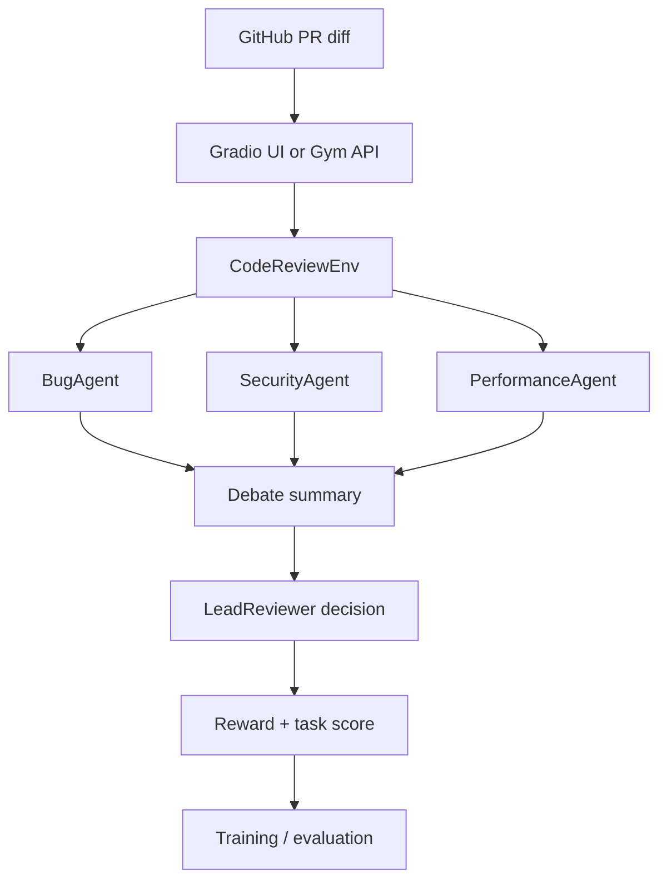

# PR Pilot

Gymnasium-compatible reinforcement learning environment for automated pull-request code review.

---

## Research framing

PR Pilot targets a concrete capability gap: reliable, multi-step code review under partial information.
The environment is designed to test whether an agent can:

- inspect a diff and associated metadata,
- coordinate specialist reviewers,
- negotiate changes instead of making one-shot decisions,
- and improve its decisions through training.

This makes the project closer to a research benchmark than a simple demo, because the agent must reason over state, debate, and delayed feedback.

Key research contributions:

1. Multi-agent code-review simulation with specialist agents and debate.
2. Reward shaping that rewards both intermediate review behavior and terminal decisions.
3. Adaptive curriculum across easy, medium, and hard PRs.
4. Colab training pipeline that produces reward evidence and baseline comparison.

---

## Overview

PR Pilot simulates the workflow of a GitHub pull-request review.
Each episode presents the agent with a real-looking PR diff and metadata.
The agent must decide how to respond — approve, reject, comment on a bug,
suggest a patch, or request changes — and is scored on accuracy and quality.

Multi-agent review is supported: BugAgent, SecurityAgent, and PerformanceAgent
analyze the PR, debate, and provide a summary before the LeadReviewer agent
makes a final decision.

The environment is intentionally structured as a partially observable review task,
so the agent must combine diff text, test results, lint results, and debate output.

---

## Submission artifacts

- Hugging Face blog: [HACKATHON_BLOG.md](HACKATHON_BLOG.md)
- Training notebook: [training_trl_colab.ipynb](training_trl_colab.ipynb)
- Training summary: [results/training_summary.txt](results/training_summary.txt)
- Reward plot: [results/TrainingProgress_Reward.png](results/TrainingProgress_Reward.png)
- Baseline plot: [results/TrainingAgent_RandomPolicy.png](results/TrainingAgent_RandomPolicy.png)

The notebook includes imported Colab outputs, and the results folder keeps the
saved plots and summary available for judges.

---

## Project structure

```
PR-Pilot/
├── code_review_env/      ← Gymnasium environment (env.py, state.py, actions.py, reward.py)
├── tasks/                ← Evaluation logic (easy / medium / hard)
├── graders/              ← Deterministic graders (wrap tasks)
├── data/                 ← PR datasets (JSON)  easy / medium / hard
├── baseline/             ← run_agent.py  (heuristic + LLM agents)
├── app/                  ← FastAPI REST API (main.py)
├── tests/                ← 74 pytest unit + integration tests
├── configs/              ← gym.yaml  metadata
├── .github/workflows/    ← CI: tests on Python 3.10 / 3.11 / 3.12
├── gradio_app.py         ← Interactive Gradio web UI
├── pyproject.toml        ← Modern PEP 621 package definition
├── setup.py              ← Legacy editable install shim
├── Dockerfile
├── requirements.txt
└── README.md
```

---

## Quick Start

### 1. Install

```bash
git clone https://github.com/ANUSHA0320/PR_Pilot.git
cd PR_Pilot
pip install -r requirements.txt
# or editable install:
pip install -e .
```

### 2. Launch the Gradio UI

```bash
python gradio_app.py
# Open: http://localhost:7860
```

### 3. Run heuristic baseline (no API key)

```bash
python baseline/run_agent.py --no-llm --episodes 5
```

### 4. Run LLM baseline

```bash
export OPENAI_API_KEY=sk-...
python baseline/run_agent.py --episodes 5 --seed 42
```

### 5. Use the environment directly

```python
import gymnasium as gym
import code_review_env   # registers CodeReviewEnv-v0

env = gym.make("CodeReviewEnv-v0", difficulty="easy")
obs, info = env.reset()

done = False
while not done:
    action = env.action_space.sample()   # replace with your agent
    obs, reward, terminated, truncated, info = env.step(action)
    done = terminated or truncated
    env.render()

print("Score:", info["task_score"])
env.close()
```

---

## Difficulties

| Difficulty | Objective | Target Score |
|------------|-----------|:------------:|
| easy | Detect surface bugs (hardcoded secrets, syntax errors, unused vars) | 0.80 |
| medium | Detect logical bugs (off-by-one, SQL injection, null dereference) | 0.60 |
| hard | Suggest code-quality patches (Pythonic rewrites, context managers) | 0.40 |

---

## Observation space

```python
spaces.Dict({
    "diff_patch":          spaces.Text(min_length=0, max_length=4096, charset=string.printable),
    "repository_context":  spaces.Text(min_length=0, max_length=512,  charset=string.printable),
    "test_results":        spaces.Dict({"tests_passed":    spaces.Discrete(2)}),  # 0=fail 1=pass
    "lint_report":         spaces.Dict({"unused_variable": spaces.Discrete(2)}),  # 0=clean 1=warn
    "file_type":           spaces.Text(min_length=1, max_length=64,   charset=string.printable),
  "agent_reports":        spaces.Dict({
    "bug":         spaces.Text(min_length=0, max_length=512, charset=string.printable),
    "security":    spaces.Text(min_length=0, max_length=512, charset=string.printable),
    "performance": spaces.Text(min_length=0, max_length=512, charset=string.printable),
  }),
  "debate_summary":       spaces.Text(min_length=0, max_length=512,  charset=string.printable),
  "conversation_history": spaces.Text(min_length=0, max_length=2048, charset=string.printable),
  "author_reply":         spaces.Text(min_length=0, max_length=512,  charset=string.printable),
  "iteration":            spaces.Discrete(6),
})
```

---

## Action space

```python
spaces.Discrete(5)
```

| Action | Label | Terminal? | When to use |
|:------:|-------|:---------:|-------------|
| 0 | `approve` | Yes | PR looks clean |
| 1 | `reject` | Yes | PR has a critical bug |
| 2 | `request_changes` | No | Issues found but fixable — ask for revision |
| 3 | `comment_bug` | No | Annotate a specific bug in the diff |
| 4 | `suggest_patch` | No | Propose an improved version of the code |

---

## Reward shaping

| Event | Reward |
|-------|-------:|
| Correct bug detection | +0.40 |
| Correct review decision | +0.30 |
| Useful code suggestion | +0.20 |
| Request changes on buggy PR | +0.10 |
| Approve buggy code | −0.30 |
| Reject clean code | −0.20 |
| Terminal bonus (task score × 0.5) | +0–0.50 |

The reward also includes small bonuses for reviewer decisions made after
AuthorAgent feedback during request-changes negotiation.

---

## Multi-agent flow

1. PR arrives
2. BugAgent analyzes
3. SecurityAgent analyzes
4. PerformanceAgent analyzes
5. Agents debate
6. LeadReviewer decides

The environment logs a conversation history and the AuthorAgent reply so
training scripts can learn from negotiation dynamics.

---

## Adaptive curriculum

Use `difficulty="adaptive"` to enable self-improving difficulty sampling.
The environment promotes from easy → medium → hard as recent scores improve.

---

## REST API

A FastAPI server exposes the environment over HTTP with a Swagger UI:

```bash
uvicorn app.main:app --host 0.0.0.0 --port 7860
# Open: http://localhost:7860/docs
```

| Endpoint | Method | Description |
|----------|--------|-------------|
| `/` | GET | Welcome page |
| `/health` | GET | Health check |
| `/reset` | GET | Start new episode (`?difficulty=easy`) |
| `/step` | POST | Submit action `{"action": 3, "difficulty": "easy"}` |
| `/render` | GET | Current state summary |
| `/scores` | GET | Leaderboard of completed episodes |
| `/actions` | GET | List all actions |
| `/docs` | GET | Interactive Swagger UI |

---

## Docker

```bash
# Build
docker build -t code-review-env .

# Run Gradio UI on port 7860 (default)
docker run -p 7860:7860 code-review-env

# Run FastAPI REST server instead
docker run -p 7860:7860 code-review-env \
  uvicorn app.main:app --host 0.0.0.0 --port 7860

# Run heuristic baseline only
docker run code-review-env \
  python baseline/run_agent.py --no-llm --episodes 5
```

---

## Gradio UI

The interactive Gradio app (`gradio_app.py`) provides three tabs:

| Tab | Description |
|-----|-------------|
| Play | Load a PR, choose an action, and see live reward feedback |
| Leaderboard | Table of completed episodes with per-difficulty averages |
| About | API reference, observation space, action space, and quick start |

The Auto Demo button runs a full heuristic episode automatically.

---

## Baseline scores

Scores measured over 8 episodes (full dataset) with `--seed 42`:

| Agent | Easy | Medium | Hard |
|-------|:----:|:------:|:----:|
| HeuristicAgent (no LLM) | 1.000 | 1.000 | 0.580 |
| GPT-3.5-turbo | ~0.90 | ~0.75 | ~0.60 |

> Hard score for HeuristicAgent reflects patch similarity from observable diff lines only (no access to reference patch).

---

## Training results

Latest Colab run:

- 100 episodes
- average reward: 0.052
- final 5 episodes average reward: 0.360
- reward range: [-0.300, 0.800]

Artifacts:

- [Training progress](results/TrainingProgress_RewardDistribution.png)
- [Baseline comparison](results/TrainingAgent_RandomPolicy.png)
- [Training summary](results/training_summary.txt)

This is the main evidence that the agent improves during training.

---

## Story and presentation

- GitHub repository: https://github.com/ANUSHA0320/PR_Pilot.git
- Hugging Face Space: https://huggingface.co/spaces/anu1720/PR_Pilot
- Google Slides: https://docs.google.com/presentation/d/1t8M1xrouFHtkEMYPHxooE1_zQ9b-NjjvNnqe77Wiilg/edit?slide=id.g3e64c8d2d4c_0_2246#slide=id.g3e64c8d2d4c_0_2246

The presentation should explain the problem, the environment flow, and the training results in under two minutes.

---

## System overview



The same flow is used in the Space, the notebook, and the baseline scripts.

---

## Continuous integration

The repository ships with a GitHub Actions workflow (`.github/workflows/tests.yml`) that runs on every push and pull request:

- **Matrix:** Python 3.10, 3.11, 3.12 on `ubuntu-latest`
- **Steps:** install deps → `pytest` with coverage → `check_env` on all difficulties → heuristic baseline smoke test

---

## Gymnasium compliance

The environment passes `gymnasium.utils.env_checker.check_env` on all three difficulties:

```python
from gymnasium.utils.env_checker import check_env
import code_review_env
from code_review_env.env import CodeReviewEnv

for difficulty in ("easy", "medium", "hard"):
    env = CodeReviewEnv(difficulty=difficulty)
    check_env(env)   # no errors
    env.close()
    print(f"check_env({difficulty}) PASSED")
```

---

## Hugging Face Spaces deployment

This repo is configured for [Hugging Face Spaces](https://huggingface.co/spaces/anu1720/PR_Pilot) with `sdk: docker`.
The Dockerfile builds and serves the Gradio UI on port 7860.

To deploy your own fork:

```bash
git remote add hf https://huggingface.co/spaces/<your-user>/<your-space>
git push hf main
```

---

## License

MIT
